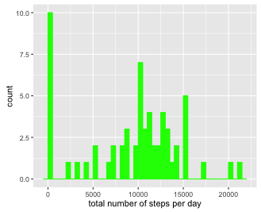
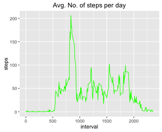
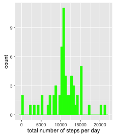
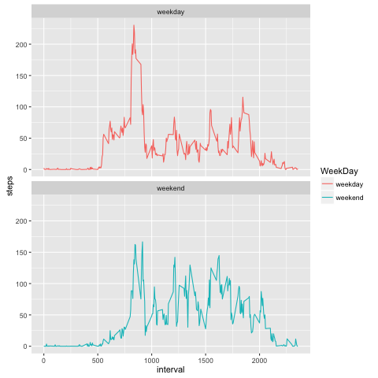

## Loading and preprocessing the data

setwd("./GitHub/RepData_PeerAssessment1")

list.files()

unzip("activity.zip")

data <- read.csv("activity.csv")

head(data)

str(data)

library(lubridate) 

data$date <- ymd(data$date)

## What is mean total number of steps taken per day?

library(ggplot2)
library(dplyr)

stepPerDay <- tapply(data$steps, data$date,FUN = sum,  na.rm = TRUE  )

qplot(stepPerDay, binwidth=500, xlab="total number of steps per day", fill=I("green"),col=I("green"))



stepsPerDayMean <- mean(stepPerDay , na.rm = TRUE)

stepsPerDayMedian <- median(stepPerDay, na.rm = TRUE)
```
stepsPerDayMean:  9354.23
stepsPerDayMedian: 10395
```

## What is the average daily activity pattern?

averages <- aggregate(x=list(steps=data$steps), by=list(interval=data$interval),FUN=mean, na.rm=TRUE)

#####1.Make a time series plot (i.e. 𝚝𝚢𝚙𝚎 = "𝚕") of the 5-minute interval (x-axis) and the average number of steps taken, averaged across all days (y-axis)

png("./instructions_fig/seriesplot.png", width=480, height= 480)

ggplot(data=averages, aes(x=interval, y=steps)) + geom_line(color = "green") + ggtitle("Avg. No. of steps per day")



dev.off()

#####2. Which 5-minute interval, on average across all the days in the dataset, contains the maximum number of steps?


averages[which.max(averages$steps),]
```
       interval    steps
104      835       206.1698

```


## Imputing missing values

##### 1. Calculate and report the total number of missing values in the dataset (i.e. the total number of rows with 𝙽𝙰s)


sum(is.na(data$steps))
````
[1] 2304
````

##### 2. Strategy for filling in all of the missing values in the dataset, with the average number of steps in the same 5-min interval

data_with_NA <- data
nas <- is.na(data_with_NA$steps)
avg_interval <- tapply(data_with_NA$steps, data_with_NA$interval, mean, na.rm=TRUE, simplify=TRUE)
data_with_NA$steps[nas] <- avg_interval[as.character(data_with_NA$interval[nas])]


sum(is.na(data_with_NA$steps))
````
[1] 0
````

##### 3.create a new dataset that is equal to the original dataset but with the missing data filled in.

data_without_NA <- data_with_NA

summary(data_without_NA)

```
 steps             date               interval     
 Min.   :  0.00   Min.   :2012-10-01   Min.   :   0.0  
 1st Qu.:  0.00   1st Qu.:2012-10-16   1st Qu.: 588.8  
 Median :  0.00   Median :2012-10-31   Median :1177.5  
 Mean   : 37.38   Mean   :2012-10-31   Mean   :1177.5  
 3rd Qu.: 27.00   3rd Qu.:2012-11-15   3rd Qu.:1766.2  
 Max.   :806.00   Max.   :2012-11-30   Max.   :2355.0
```

##### 4. Make a histogram of the total number of steps taken each day and Calculate and report the mean and median total number of steps taken per day. Do these values differ from the estimates from the first part of the assignment? What is the impact of imputing missing data on the estimates of the total daily number of steps?


stepPerDay_without_NA <- tapply(data_without_NA$steps, data_without_NA$date,FUN = sum )

png("./instructions_fig/Histogram2.png", width=480, height= 480)

qplot(stepPerDay_without_NA, binwidth=500, xlab="total number of steps per day", fill=I("green"),col=I("green"))



dev.off()

stepsPerDayMean_without_NA <- mean(stepPerDay_without_NA , na.rm = TRUE)

stepsPerDayMedian_without_NA <- median(stepPerDay_without_NA, na.rm = TRUE)
stepsPerDayMean_without_NA
stepsPerDayMedian_without_NA

```
stepsPerDayMean_without_NA:  10766.19
stepsPerDayMedian_without_NA: 10766.19
```

## Are there differences in activity patterns between weekdays and weekends?

##### 1. Create a new factor variable in the dataset with two levels – “weekday” and “weekend” indicating whether a given date is a weekday or weekend day.

days_of_week <- function(date) {
    day <- weekdays(date)
    if (day %in% c("Monday", "Tuesday", "Wednesday", "Thursday", "Friday"))
        return("weekday")
    else if (day %in% c("Saturday", "Sunday"))
        return("weekend")
    else
        stop("invalid date")
}

data_without_NA$WeekDay <- sapply(data_without_NA$date, FUN = days_of_week)

str(data_without_NA)

````
'data.frame':	17568 obs. of  4 variables:
 $ steps   : num  1.717 0.3396 0.1321 0.1509 0.0755 ...
 $ date    : POSIXct, format: "2012-10-01" "2012-10-01" "2012-10-01" "2012-10-01" ...
 $ interval: int  0 5 10 15 20 25 30 35 40 45 ...
 $ WeekDay : chr  "weekday" "weekday" "weekday" "weekday" ...
````

library(dplyr)

interval_days_of_week <- data_without_NA %>%  group_by(interval, WeekDay) %>%
  
head(interval_days_of_week)  
````
interval WeekDay      steps
     (int)   (chr)      (dbl)
1        0 weekday 2.25115304
2        0 weekend 0.21462264
3        5 weekday 0.44528302
4        5 weekend 0.04245283
5       10 weekday 0.17316562
6       10 weekend 0.01650943
````


##### 2. panel plot containing a time series plot

png("./instructions_fig/seriesplot2.png", width=480, height= 480)

ggplot(interval_days_of_week, aes(x=interval, y=steps, color = WeekDay)) +
  geom_line() + facet_wrap(~WeekDay, ncol = 1, nrow=2)



dev.off()


