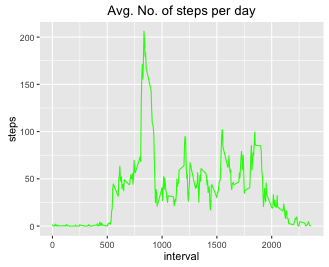

# Reproducible Research: Peer Assessment 1

## Loading and preprocessing the data

setwd("./GitHub/RepData_PeerAssessment1")

list.files()

unzip("activity.zip")

data <- read.csv("activity.csv")

head(data)

str(data)

library(lubridate) 

data$date <- ymd(data$date)

## What is mean total number of steps taken per day?

library(ggplot2)
library(dplyr)

stepPerDay <- tapply(data$steps, data$date,FUN = sum,  na.rm = TRUE  )

qplot(stepPerDay, binwidth=500, xlab="total number of steps per day", fill=I("green"),col=I("green"))


stepsPerDayMean <- mean(stepPerDay , na.rm = TRUE)

stepsPerDayMedian <- median(stepPerDay, na.rm = TRUE)
```
stepsPerDayMean:  9354.23
stepsPerDayMedian: 10395
```

## What is the average daily activity pattern?

averages <- aggregate(x=list(steps=data$steps), by=list(interval=data$interval),FUN=mean, na.rm=TRUE)

####1.Make a time series plot (i.e. 𝚝𝚢𝚙𝚎 = "𝚕") of the 5-minute interval (x-axis) and the average number of steps taken, averaged across all days (y-axis)

ggplot(data=averages, aes(x=interval, y=steps)) + geom_line(color = "green") + ggtitle("Avg. No. of steps per day")

##

####2. Which 5-minute interval, on average across all the days in the dataset, contains the maximum number of steps?

averages[which.max(averages$steps),]
```
       interval    steps
104      835       206.1698

```


## Imputing missing values


## Are there differences in activity patterns between weekdays and weekends?
